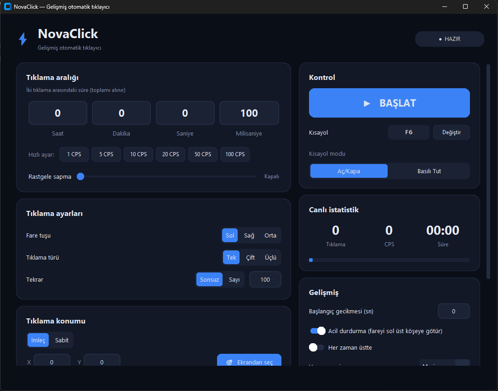

# ⚡ NovaClick

Modern arayüzlü, gelişmiş ve açık kaynaklı otomatik tıklayıcı (autoclicker). Windows için geliştirildi.

> 🤖 **Bu proje, Anthropic'in yapay zekâ asistanı [Claude](https://claude.ai) ile birlikte geliştirilmiştir.**



**⬇️ [Son sürümü indir](../../releases/latest)** — Python gerekmez, `novaclick.exe` dosyasına çift tıklaman yeterli.

## Özellikler

- **Hassas aralık:** saat / dakika / saniye / milisaniye + hızlı CPS ön ayarları (1, 5, 10, 20, 50, 100)
- **Rastgele sapma (jitter):** ±0–500 ms, insan benzeri tıklama aralığı
- **Fare tuşu ve tür:** sol / sağ / orta tuş; tek / çift / üçlü tıklama
- **Tekrar:** sonsuz ya da belirli sayıda
- **Konum:** imleç konumunda veya sabit koordinatta (ekrandan seçilebilir)
- **Arka plan modu (Windows):** seçtiğin pencerenin belirli noktasına, fareni hareket ettirmeden tıklar; Alt-Tab yapıp bilgisayarı normal kullanabilirsin
- **Global kısayol:** varsayılan `F6`, değiştirilebilir; *Aç/Kapa* ve *Basılı Tut* modları
- **Güvenlik:** başlangıç gecikmesi, acil durdurma (fareyi sol üst köşeye götür)
- **Canlı istatistik:** toplam tıklama, anlık CPS, süre, ilerleme çubuğu
- **Profiller:** ayarları isimle kaydet / yükle / sil
- **Tema:** koyu tasarım, 5 vurgu rengi, her zaman üstte seçeneği

## Kurulum

### 1) Hazır exe (en kolayı)
[Releases](../../releases/latest) sayfasından `novaclick.exe` dosyasını indir ve çift tıkla. Python kurmana, kurulum yapmana gerek yok; Windows 10/11 (64 bit) yeterli. Exe, GitHub Actions ile bu depodaki kaynak koddan otomatik üretilir.

> ⚠️ İlk açılışta Windows bir uyarı gösterebilir. Bu normaldir, nedenini ve nasıl geçeceğini [aşağıda](#windows-uyarısı-smartscreen) anlattım.

### 2) Kaynak koddan çalıştırma
[Python 3.10+](https://www.python.org/downloads/) kurulu olmalı (kurulumda **Add python.exe to PATH** işaretli olsun).

```bash
git clone https://github.com/rrchech011/NovaClick.git
cd NovaClick
pip install -r requirements.txt
python novaclick.py
```

### 3) Kendi exe'ni üret
`build.bat` dosyasına çift tıkla, ya da:

```bash
pip install pyinstaller
pyinstaller --noconsole --onefile --clean --icon=novaclick.ico --add-data "novaclick.ico;." --collect-all customtkinter novaclick.py
```

Exe `dist\novaclick.exe` olarak oluşur.

## Windows uyarısı (SmartScreen)

Exe'yi ilk çalıştırdığında **"Windows kişisel bilgisayarınızı korudu"** ekranı çıkabilir ve yayımcı olarak "Bilinmeyen yayımcı" yazabilir. Bunun nedeni, exe'nin henüz dijital olarak imzalı olmaması ve Windows'un yeni, tanınmayan dosyalara temkinli davranmasıdır. Dosyanın zararlı olduğu anlamına gelmez. Şu an exe imzalı değil.

**Çalıştırmak için:**

1. Uyarı ekranında **Ek bilgi**'ye tıkla.
2. Çıkan **Yine de çalıştır** düğmesine bas.

**Güvenmek istersen:**

- Kaynak kodun tamamı bu depoda açık. Exe, bu koddan GitHub Actions ile otomatik üretilir; **Actions** sekmesinde üretim kayıtlarını görebilirsin.
- Program yalnızca senin seçtiğin kısayol tuşunu (varsayılan `F6`) dinler, yazdıklarını kaydetmez. İnternete bağlanmaz; yazdığı tek dosya ayar dosyasıdır (`~/.novaclick.json`). Kodu `novaclick.py` içinde inceleyebilirsin.
- Exe'yi [VirusTotal](https://www.virustotal.com)'a yükleyip kontrol edebilirsin.
- İstersen exe yerine kaynak koddan çalıştır ya da `build.bat` ile exe'yi kendin üret.

Klavye kısayolu dinleyen, PyInstaller ile üretilmiş programlar bazı antivirüslerde yanlış alarm verebilir. Böyle bir durumda yukarıdaki yollardan birini kullanabilirsin.

## Kullanım

1. Aralığı ve tıklama ayarlarını seç.
2. `F6` ile başlat, tekrar `F6` ile durdur (ya da **BAŞLAT** düğmesi).
3. Fare modunda acil durdurma için imleci ekranın sol üst köşesine götür.

### Arka plan modu

1. **Tıklama konumu** kartında **Arka plan**'ı seç.
2. **Pencere seç**'e bas, hedef pencerede tıklanmasını istediğin noktaya bir kez tıkla.
3. `F6` ile başlat. Artık fareni ve klavyeni özgürce kullanabilirsin.

Bu mod Windows'un pencere mesajlarını kullanır. Bilinen sınırlar:

- Her programda çalışmaz; bazı oyunlar, tarayıcı/Electron ve Microsoft Store uygulamaları bu mesajları yok sayabilir.
- Yönetici olarak çalışan bir programa tıklatmak için NovaClick'i de yönetici olarak çalıştır.
- Hedef pencere küçültülürse bazı programlar tıklamayı almaz.
- Ekran ölçeklemesi (%125, %150…) eski tip programlarda seçilen noktayı kaydırabilir.
- Bu modda acil durdurma köşesi kapalıdır; durdurmak için kısayol tuşunu kullan.

## Sorumlu kullanım

Bu araç kişisel kullanım ve otomasyon içindir. Çevrimiçi oyunlarda ve kuralların otomatik tıklamayı yasakladığı servislerde kullanmak hesabının kapatılmasına yol açabilir. Sorumluluk kullanıcıya aittir.

## Lisans

[MIT](LICENSE)

---

## English

**NovaClick** is a modern, feature-rich, open-source autoclicker for Windows built with Python, CustomTkinter and pynput. It has millisecond-precision intervals, random jitter, global hotkeys (toggle / hold), fixed-position clicking, profiles, live stats and a **background mode** that clicks a chosen spot in a chosen window without moving your real mouse.

**Built together with [Claude](https://claude.ai) by Anthropic.**

```bash
pip install -r requirements.txt
python novaclick.py
```

**Windows SmartScreen note:** the exe is not code-signed yet, so Windows may show a "Windows protected your PC" warning on first launch. Click **More info → Run anyway**. The full source is in this repo and the exe is built from it by GitHub Actions.

Licensed under MIT. Use responsibly: automated clicking may violate the rules of online games and some services.
